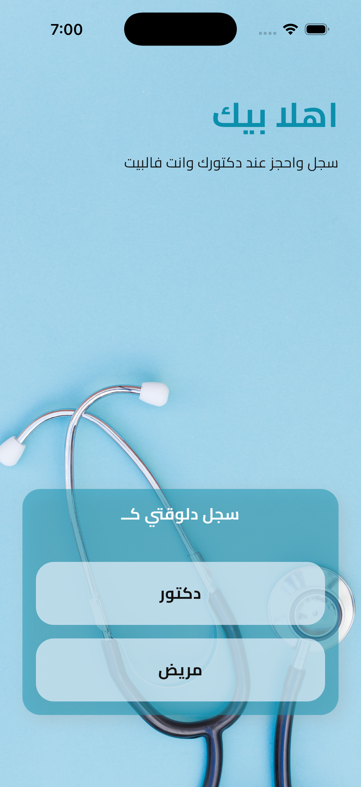
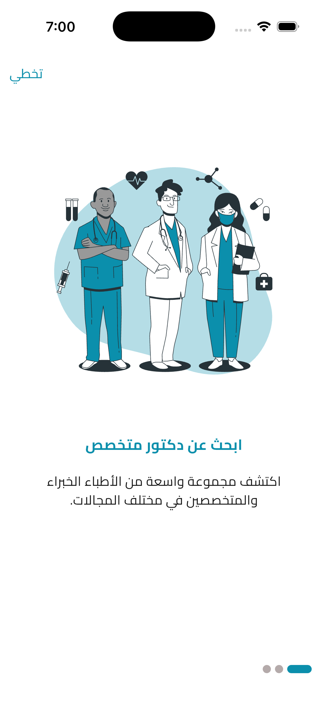
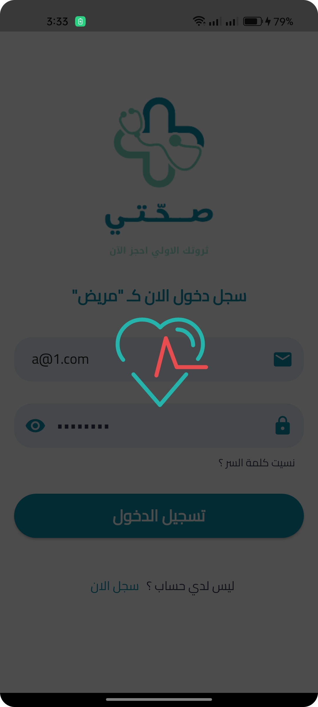
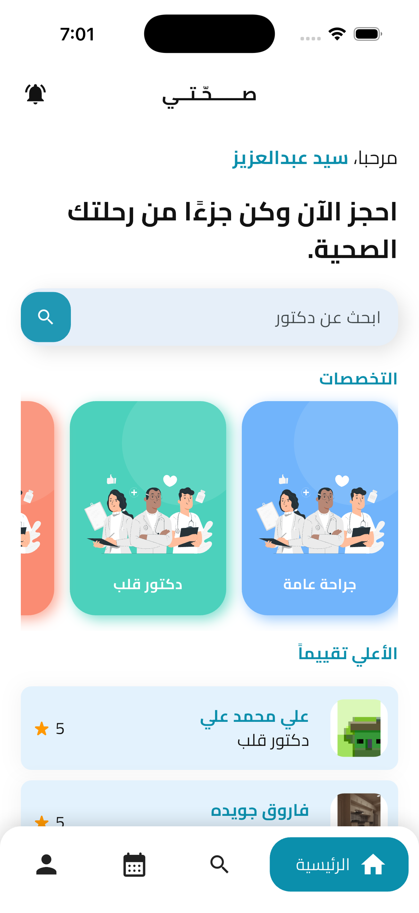
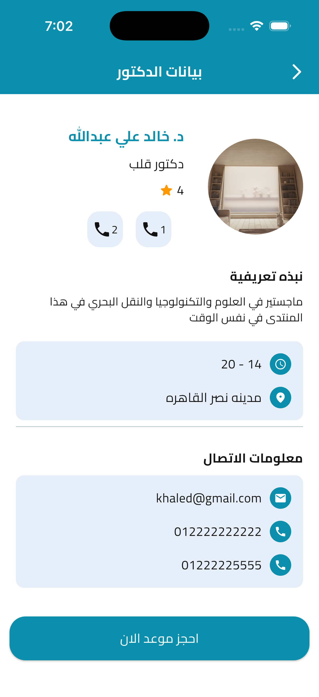
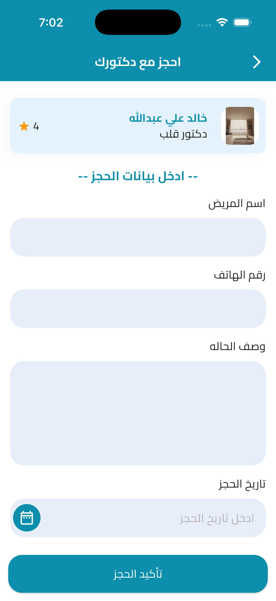
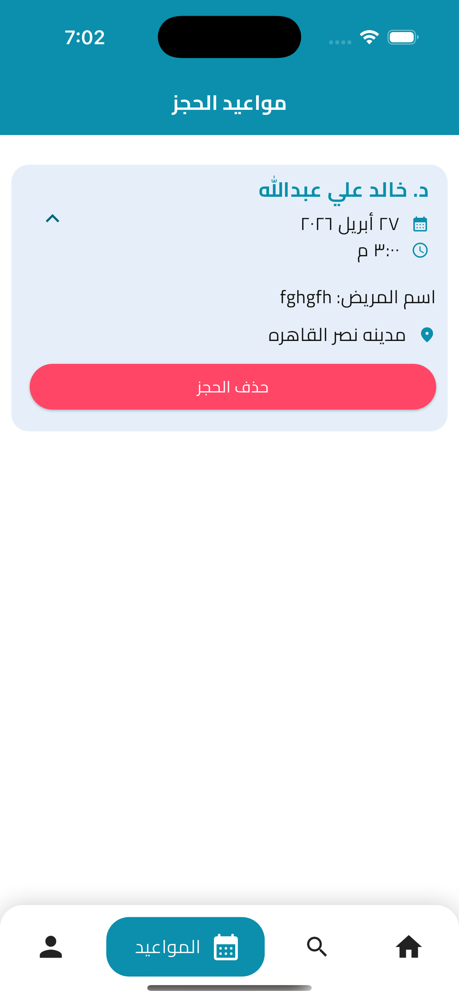
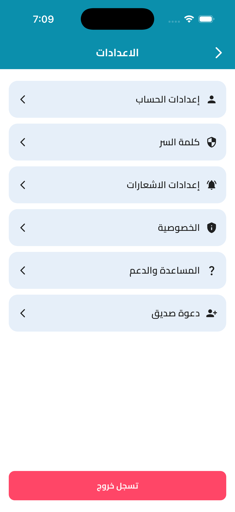

<<<<<<< HEAD
<div align="center">


# 🏥 صحّتي — Se7ety

**منصة حجز مواعيد طبية ذكية**  
اتصل بدكتورك، احجز موعدك، وتابع صحتك — كل ده في مكان واحد.

[](https://flutter.dev)
[](https://dart.dev)
[](https://firebase.google.com)
[](https://bloclibrary.dev)
[](LICENSE)

</div>

---

## 📱 لقطات من التطبيق

| Welcome | Onboarding | Login | Home |
|---------|-----------|-------|------|
|  |  |  |  |

| Doctor Profile | Book Appointment | Appointments | Settings |
|---------------|-----------------|-------------|----------|
|  |  |  |  |

---

## ✨ المميزات

### للمريض 🧑‍⚕️
- **تسجيل سهل** — اختر نوع حسابك (مريض / دكتور) من أول ما تفتح التطبيق
- **بحث متقدم** — ابحث عن دكتور بالاسم أو التخصص
- **تصفح التخصصات** — جراحة قلب، عظام، جلدية، وأكثر
- **ملف الدكتور** — شوف التقييم، ساعات العمل، العنوان، ومعلومات التواصل
- **حجز موعد** — اختر التاريخ والوقت المناسب بخطوات بسيطة
- **إدارة الحجوزات** — اعرض وحذف مواعيدك في أي وقت
- **الدكاترة الأعلى تقييماً** — شوف أفضل الدكاترة فوراً على الشاشة الرئيسية

### عام 🌐
- واجهة عربية بالكامل مع دعم RTL
- خط Cairo الاحترافي
- تصميم جميل بألوان Teal هادية
- Splash Screen وOnboarding سلس
- إعدادات كاملة: حساب، كلمة سر، إشعارات، خصوصية، دعوة صديق

---

## 🏗️ معمارية المشروع

المشروع مبني على **Clean Architecture** مع **BLoC** لإدارة الحالة:

```
lib/
├── core/
│   ├── theme/           # ألوان، خطوط، ثيم التطبيق
│   ├── utils/           # دوال مساعدة مشتركة
│   ├── widgets/         # Widgets مشتركة
│   └── routes/          # إدارة التنقل
│
└── features/
    ├── auth/            # تسجيل الدخول والتسجيل
    │   ├── data/        # Repository + Data Sources
    │   ├── domain/      # Entities + Use Cases
    │   └── presentation/# Screens + BLoC
    │
    ├── home/            # الشاشة الرئيسية والبحث
    ├── doctors/         # قائمة وبروفايل الدكاترة
    ├── appointments/    # الحجز وعرض المواعيد
    ├── settings/        # إعدادات التطبيق
    └── onboarding/      # شاشات الترحيب
```

---

## 🛠️ التقنيات المستخدمة

| المكتبة | الإصدار | الاستخدام |
|---------|---------|-----------|
| `flutter_bloc` | 9.1.1 | إدارة الحالة (State Management) |
| `firebase_auth` | 5.3.4 | تسجيل الدخول والمصادقة |
| `cloud_firestore` | 5.5.1 | قاعدة بيانات السحابة |
| `firebase_storage` | 12.3.7 | تخزين الصور والملفات |
| `flutter_svg` | 2.0.16 | الأيقونات والصور المتجهية |
| `image_picker` | 1.1.2 | رفع صور المستخدم |
| `shared_preferences` | 2.3.3 | حفظ بيانات محلية |
| `smooth_page_indicator` | 1.2.0 | مؤشرات الـ Onboarding |
| `google_nav_bar` | 5.0.7 | شريط التنقل السفلي |
| `lottie` | 3.2.0 | الأنيميشن |
| `url_launcher` | 6.3.1 | فتح روابط وأرقام هاتف |
| `gap` | 3.0.1 | مسافات بين العناصر |
| `intl` | — | تنسيق التواريخ (عربي) |

---

## 🚀 تشغيل المشروع

### المتطلبات

- Flutter SDK `>= 3.5.4`
- Dart SDK `>= 3.5.4`
- حساب Firebase مع مشروع مُعدّ

### خطوات التثبيت

```bash
# 1. Clone المشروع
git clone https://github.com/ahmed24E/se7ety.git
cd se7ety

# 2. تثبيت الـ dependencies
flutter pub get

# 3. إعداد Firebase
# أضف ملف google-services.json في android/app/
# أضف ملف GoogleService-Info.plist في ios/Runner/

# 4. تشغيل التطبيق
flutter run
```

### إعداد Firebase

1. أنشئ مشروع جديد على [Firebase Console](https://console.firebase.google.com)
2. فعّل **Authentication** (Email/Password)
3. أنشئ **Firestore Database**
4. فعّل **Firebase Storage**
5. نزّل ملفات الإعداد وضعها في مكانها الصح

---

## 🗂️ هيكل قاعدة البيانات (Firestore)

```
users/
  {userId}/
    name: string
    email: string
    role: "patient" | "doctor"
    phone: string

doctors/
  {doctorId}/
    name: string
    specialty: string
    rating: number
    workingHours: string
    location: string
    email: string
    phones: array

appointments/
  {appointmentId}/
    doctorId: string
    patientId: string
    patientName: string
    date: timestamp
    time: string
    location: string
    description: string
```

---

## 📂 الشاشات

| الشاشة | الوصف |
|--------|-------|
| Splash / Welcome | شاشة ترحيب مع صورة سماعة الطبيب وخيار نوع التسجيل |
| Onboarding | 3 شاشات تعريفية بالميزات مع مؤشر تقدم |
| Login / Register | تسجيل دخول للمريض أو الدكتور بالبريد وكلمة السر |
| Home | بحث + التخصصات + أعلى الدكاترة تقييماً |
| Doctor Profile | كل تفاصيل الدكتور مع زر حجز فوري |
| Book Appointment | فورم الحجز مع اختيار التاريخ والوقت |
| Appointments | قائمة مواعيد المريض مع إمكانية الحذف |
| Settings | إعدادات الحساب، كلمة السر، الإشعارات، والخصوصية |

---

## 🧑‍💻 المطور

**أحمد عيد عبد الصادق**  
Flutter Developer  
📍 اسوان، مصر

[](https://github.com/ahmed24E)

---

## 📄 الرخصة

هذا المشروع متاح تحت رخصة [MIT](LICENSE).

---

<div align="center">

صُنع بـ ❤️ وـ Flutter في مصر 🇪🇬

</div>
=======
# se7ety_123

A new Flutter project.
>>>>>>> 6b47441972e9b2bf08df274ec1434acaef537b54
